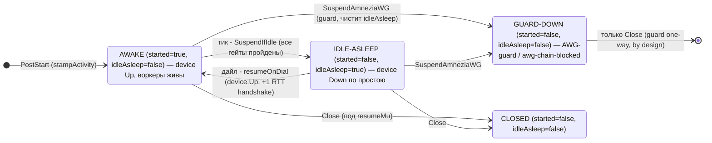
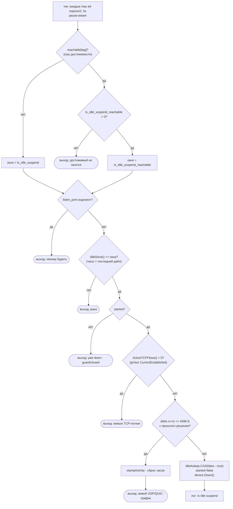

# SPEC 020 — Idle-suspend простаивающих WireGuard/AmneziaWG эндпоинтов

| Поле | Значение |
|------|----------|
| Тип | F (feature) |
| Статус | C (complete) — проверено вживую (desktop + Android device) и юнит-тестами |
| Тег сборки | `with_lx_idle_suspend` (mobile-only, в AAR; НЕ в desktop/CLI) |
| Фича-флаг | `route.lx_idle_suspend: "<duration>"` (отсутствует/`0` = выключена) |

Фича `lx_idle_suspend` выборочно **гасит** (`device.Down()`) WG/AWG-эндпоинт, который одновременно **недостижим** из активного дерева маршрутизации и **простаивает** дольше порога. Пробуждение — лениво, на следующем дайле через эндпоинт (`device.Up()`). Опциональный второй порог `lx_idle_suspend_reachable` гасит и **достижимые** эндпоинты после более длинного окна простоя (см. «Конфигурация»).

Первопричина нагрева и heap A/B — в [RESEARCH.md](RESEARCH.md). Хронология (найденный баг, отвергнутые альтернативы, эволюция путей) — в [HISTORY.md](HISTORY.md).

---

## Что это

На Android ядро греется и пинит CPU: **каждый** живой WG/AWG-эндпоинт работает 24/7 независимо от трафика. При N эндпоинтах все N держат:
- **recv-воркеры** со своими `bufsArrs` (`make([]*[65535]byte, BatchSize)`) — при `BatchSize=128` это ~8 МБ/воркер, 2 воркера/устройство. **Главный держатель GC-scan нагрева** (доказано heap A/B, [RESEARCH.md](RESEARCH.md)).
- **per-peer таймеры** (keepalive, handshake-retransmit) + для AWG junk-machinery — будят радио, жгут CPU/батарею на простое.
- **gvisor `stack.Stack`** netstack на каждый эндпоинт.

До фичи не было понятия «этот эндпоинт сейчас недостижим из активного маршрута» — только глобальная пауза (экран off, гасит ВСЕ), полный `Close()` и AWG-detour-guard. Выборочного засыпания простаивающих нод не было.

## Архитектура

Три части: (1) **модель достижимости** — кто сейчас достижим; (2) **кэш + инвалидация** — считаем редко; (3) **сторона эндпоинта** — учёт простоя, Down/Up.

### Слой 1 — модель достижимости (reachability)

Эндпоинт **достижим**, если трафик может прямо сейчас на него попасть. Динамический обход активного дерева (НЕ статический `ConsumersOf`/`dependByTag`, который перечисляет ВСЕ члены селектора — нам нужен *активный* выбор).

**Сиды** (точки входа):
- **final**: `outboundManager.Default()`.
- **Правила**: каждый outbound-тег из действия правила (`route`/`bypass`) в `router.Rules()`. Действия reject/sniff/dns/resolve/hijack-dns сида не дают.
- **DNS-detour'ы**: `OutboundTag()` каждого DNS-транспорта (`dnsTransportManager.Transports()`). DNS-сервер дайлится на каждой резолюции — его detour достижим по определению; без сида DNS-only-WG эндпоинт флапал бы Down/Up вокруг каждой паузы, добавляя handshake к первому DNS-запросу каждой сессии.

**Обход вниз** от каждого сида (visited-set = дедуп + защита от циклов):

| Тип узла | Достижимые дети |
|---|---|
| selector | **только** `Now()` (текущий выбор), НЕ `All()` |
| urltest round_robin | **весь** текущий пул — `ActiveTags()` |
| urltest legacy (least_test) | `Now()` |
| обычный outbound | его `Dependencies()` (detour-цепочка) |

Обход транзитивный (selector→urltest→эндпоинты и т.д.). Реализация: `reachableSet`/`walkReachable` в [`route/reachability_lx.go`](../../route/reachability_lx.go) — чистые функции, развязанные с `*Router` через `resolve`-замыкание (юнит-тестируемы со стабами).

**Семантика urltest — «дайл будит, idle-тик усыпляет».** Health-check probe идёт через `DialContext` узла — то есть обычный дайл. Тот же ленивый `Up()`-на-дайле, что обслуживает трафик, будит спящий узел под probe. Узел в пуле probe'ится каждый `interval` → не простаивает → не усыпляется; выбывший из пула перестаёт probe'иться → простоит > порога → усыпляется тиком. Probe сам узел обратно не гасит — это работа тика по таймауту.

**Гейтинг проб по достижимости группы.** Обратная связь тоже стоит: после ухода селектора с urltest-группы её тикер продолжал бы пробы до `idle_timeout` (дефолт 30m = 10 циклов по N узлов), каждым probe будя усыплённых членов (handshake) впустую. Поэтому `loopCheck` перед пробой спрашивает `adapter.ReachabilityReporter` (Router, из ctx): **недостижимая группа пропускает цикл проб** (тикер жив, `idle_timeout` его добьёт; вернувшийся трафик через `Touch` — или возвращение достижимости — немедленно возобновляет пробы). С выключенной фичей (`lx_idle_suspend: 0`) или без build-тега reporter отвечает `true` для всего — гейт не вмешивается, поведение бит-в-бит апстримное. Цена согласована: history недостижимой группы стареет, первый выбор после возвращения идёт по устаревшей истории — ровно как сегодня после `idle_timeout`.

**Инвалидация первого выбора.** `performUpdateCheck` инвалидирует reach-кэш при **любой** смене выбранного узла, включая переход nil→первый выбор (раньше первый выбор кэш не инвалидировал: кэш, посчитанный на cold-start fallback-узле, зависал устаревшим до следующего auto-switch — не тот узел держался живым, а реальный усыплялся).

### Слой 2 — кэш достижимости и инвалидация (event-driven)

Полный обход на каждый тик — расточительство (бьёт по цели экономии). Набор достижимых кэшируется, пересчитывается **только когда активное дерево изменилось**:
- `r.reachDirty atomic.Bool` — «грязно» (стартует `true`).
- `r.reachCache map[string]bool` под `r.reachMu sync.RWMutex`.
- `InvalidateReachability()` (реализует `adapter.ReachabilityInvalidator`) ставит флаг. Обход НЕ под локом кэша (зовёт группы с их локами → риск лок-ордер дедлока): считаем вне лока, публикуем под локом.

Точки инвалидации (через `service.FromContext[ReachabilityInvalidator]`, чтобы `protocol/group` не импортировал `route`):

| Точка | Файл |
|---|---|
| `Selector.SelectOutbound` | `protocol/group/selector.go` |
| urltest legacy auto-switch | `protocol/group/urltest.go` |
| перестроение пула `balancer.onChange` | `protocol/group/urltest_balance_lx.go` |
| перезагрузка конфига/роутера | пересоздание Router |

Между событиями тик читает кэш и делает одно сравнение простоя на эндпоинт — без обхода.

### Слой 3 — сторона эндпоинта (учёт простоя, Down/Up)

Состояние в [`protocol/wireguard/endpoint.go`](../../protocol/wireguard/endpoint.go) (`lx:begin/lx:end idle-suspend`):
- `lastActivity atomic.Int64` (unix-nanos) — штампуется в PostStart (базовая отметка) и на каждом входе в дайл.
- `IdleSince() time.Duration`, `idleAsleep atomic.Bool` (true пока усыплён по простою — **отличается** от `started`: guard-suspend ставит `started=false` БЕЗ `idleAsleep`), `resumeMu sync.Mutex` (сериализует «усыпить» тика против «разбудить» дайла и против `Close`).
- `listenMode bool` — эндпоинт с `listen_port` (входящие пиры) **никогда не усыпляется**: у него нет дайл-пути, который бы его разбудил.
- `lastTransferSum uint64` — rx+tx устройства, увиденные предыдущим решением тика (только под `resumeMu`).

**`SuspendIfIdle(reachable, threshold, reachableThreshold)`** — решение тика (целиком под `resumeMu`):
```
если listenMode: выход                          // нет пути пробуждения
eff = threshold
если reachable:
    если reachableThreshold <= 0: выход         // достижимые по умолчанию не трогаем
    eff = reachableThreshold                    // opt-in длинное окно
если IdleSince() < eff: выход
если !started.Load(): выход                     // уже down (guard / awg-chain / закрыт)
если endpoint.ActiveTCPFlows() > 0: выход       // живые TCP-потоки в gVisor-стеке (без stamp)
delta = endpoint.TransferTotals() - lastTransferSum   // rx+tx из IpcGet, только для кандидатов
lastTransferSum += delta
если delta >= 4096:                             // настоящий (не-TCP) трафик established-потоков
    stampActivity(); выход
если idleAsleep.CAS(false→true):
    started.Store(false)
    endpoint.Suspend()                          // device.Down()
    log INFO "lx idle: suspend <tag>"           // edge-triggered
```

**Live-traffic-гейты** закрывают blackhole: активность считалась только по дайлам, а данные established-соединения идут app→conn→netstack→device, не входя в протокольный Endpoint — эндпоинт с живой закачкой, выпавший из активного дерева (селектор ушёл, пул перестроился), гасился посреди передачи, ломая обещание `interrupt_exist_connections=false`. Два гейта, оба вне hot-path (только для кандидатов на suspend):
1. **`ActiveTCPFlows()`** — gauge `TCP.CurrentEstablished` gVisor-стека устройства: точный признак живых TCP-потоков (закачки, push-сокеты), **иммунный к WG keepalive/rekey**. Без stamp'а — как только последний поток закрылся, эндпоинт снова idle. Для system-interface устройства (нет стека) gauge = 0.
2. **Порог по дельте счётчиков** (`delta >= 4096` байт между решениями) — для не-TCP-трафика (QUIC/UDP-потоки). Именно **порог**, не «счётчики сдвинулись»: keepalive (32 Б/интервал) и периодический rekey (~240 Б/~2 мин) двигают rx/tx постоянно — голая проверка «изменилось» никогда бы не усыпила пир с `persistent_keepalive`, похоронив главную экономию (глушение keepalive-таймеров). Шум остаётся сильно ниже порога; живой поток пробивает его мгновенно. Согласованная цена: **молчащий** QUIC-поток (редкие ping'и) порога не наберёт и будет усыплён — QUIC переустанавливается/мигрирует, кейс принят.

**`resumeOnDial()`** — в начале каждого дайла:
```
stampActivity()                          // всегда, закрывает гонку с тиком
если !idleAsleep: вернуть started        // быстрый путь
под resumeMu:
    endpoint.Resume()                    // device.Up()
    started.Store(true); idleAsleep.Store(false)
    log INFO "lx idle: wake <tag> by=dial"; вернуть true
```

Для domain-назначений `DialContext`/`ListenPacket` сначала резолвят через `dnsRouter` и только потом зовут `resumeOnDial` — неудачный DNS-lookup не платит Up+handshake зря (DNS-detour через сам эндпоинт безопасен: он re-enter'ит `DialContext` уже с IP и будит его сам).

`Close()` эндпоинта берёт `resumeMu` и гасит оба флага до `endpoint.Close()`: box закрывает endpoints **раньше**, чем Router останавливает тик, — без мьютекса решение тика гонялось бы с teardown'ом (`Suspend` по закрытому device).

Логирование **edge-triggered** — строка только внутри успешного CAS. Пара suspend↔wake в логе = сигнал флапа.

## Полная модель работы — состояния, гейты, таймлайны

> Развёрнутый гайд с рецептами конфигурации (RU/EN) — [docs-lx/lx-energy.ru.md](../../docs-lx/lx-energy.ru.md) / [lx-energy.md](../../docs-lx/lx-energy.md). Здесь — каноническая модель для разработчика ядра.

### Состояния эндпоинта

У WG/AWG-эндпоинта два флага (`started`, `idleAsleep`) и четыре достижимых состояния:



Инварианты переходов:
- **IDLE-ASLEEP → AWAKE** делает ТОЛЬКО настоящий дайл. Pause/wake экрана и смена сети видят транспортный флаг `suspended` и эндпоинт не поднимают; guard-состояние не воскрешается ничем.
- **GUARD-DOWN терминально** до Close — `resumeOnDial` возвращает `started` (false) на быстрый путь, тик выходит на `!started`.
- Все переходы, трогающие device (`Suspend`/`Resume`/`Close`), сериализованы `resumeMu`.

### Решение тика — цепочка гейтов `SuspendIfIdle`



Пояснения к гейтам:
- Порядок дёшево→дорого: map-lookup и атомики до `IpcGet`/stats. Гейты 5–6 (TCP/delta) выполняются только для реальных кандидатов на suspend — вне hot-path.
- **TCP-гейт без stamp'а**: закрылся последний поток — эндпоинт снова кандидат уже на следующем тике.
- **Порог 4096 Б** отделяет живой поток от keepalive/rekey-шума (32 Б/интервал + ~240 Б/~2 мин): пир с `persistent_keepalive` ЗАСЫПАЕТ (глушение его таймеров — цель фичи), молчащий QUIC-поток — согласованная жертва.

### Ночной таймлайн (канонический сценарий)

Конфиг: round_robin pool=3, `interval=15m`, `idle_timeout=30m`, `lx_idle_suspend=30s`, `lx_idle_suspend_reachable=30m`.

```
T=0        последний пользовательский дайл (Touch обновил lastActive группы)
T=0..30m   ХВОСТ ПРОБ: тикер группы жив (Since(lastActive) <= idle_timeout),
           пробы в T=15m, T=30m дайлят членов пула -> их IdleSince сбрасывается
T~45m      тик loopCheck: Since(lastActive)=45m > 30m -> ТИКЕР ГАСНЕТ (проб больше нет)
T~60m      IdleSince членов пула (от последней пробы T=30m) > reachable(30m)
           -> тик гасит все 3 узла: воркеры выходят, таймеры молчат, радио спит
...ночь... полная тишина: ни проб, ни keepalive, ни recv-воркеров
УТРО       первый дайл: pick -> слот -> resumeOnDial будит ОДИН узел (+1 RTT);
           Touch заводит тикер; loopCheck делает НЕМЕДЛЕННЫЙ дотест (lastActive стар)
           -> пул/выбор обновлены свежими замерами за секунды
```

Гарантия отсутствия гонки «проба будит засыпающего»: пробы молкнут в `T = idle_timeout`, сон достижимых наступает не раньше `T = последняя проба + reachable`; при `reachable >= idle_timeout` будильника к моменту сна физически не существует. Жёсткая валидация — только `reachable >= lx_idle_suspend`; `>= idle_timeout` — рекомендация конфигу (нарушение = 1–2 цикла флапа в хвосте, не поломка).

### Кто кого будит и глушит — сводная матрица

| Событие | Спящий (idle) эндпоинт | Guard-down AWG | Тикер проб группы |
|---|---|---|---|
| Дайл трафика через эндпоинт | **будит** (`resumeOnDial`) | не будит («not ready») | `Touch` заводит/держит |
| Проба urltest (это дайл) | **будит** — потому пробы гейтятся | не будит | — |
| Screen on / смена сети (pause-wake) | не будит (флаг `suspended`) | не будит | pause-registered: возобновляется |
| `idle_timeout` группы | — | — | **гасит насовсем** (до Touch) |
| Группа недостижима (гейт SPEC 020) | — | — | циклы **пропускаются** (тикер жив) |
| `passive_check`: выбранный жив | — | — | циклы **пропускаются** |
| Ручной тест (force) | будит всех, кого пробует | не будит | — |

## Механизм Down/Up

`device.Down()→Up()` — **полный реконнект**, не переключение таймера (source-verified против сабмодуля).

`Down()` (`downLocked`): зануляет крипто-ключи + handshake (`peer.Stop()`→`ZeroAndFlushAll()`), закрывает UDP-сокет (`BindClose`+барьер `stopping.Wait()` до выхода recv-воркеров), сносит `2·N+1` горутин. recv-воркер выходит только по `net.ErrClosed` → «recv-воркеры → 0» = **детерминированное доказательство**, что сокет закрыт и `bufsArrs` освобождены.

`Up()` синхронный, не-сетевой (поднимает bind + *инициирует* handshake). Цену платит **первый пакет** — ждёт ~1 RTT, пока WG доделает handshake (плюс на AWG вся I1-обфускация + junk). Идентично холодному дайлу.

**Что переживает цикл** (это `changeState`, не `Close`): объекты Device/Peer, ClientBind, буферные пулы, очереди шифрования + воркеры, порт. **`Down()` НЕ освобождает gvisor netstack** (~5.9 МБ/устройство) — Tier B, не реализовано (см. § «Отложено»).

Компромисс: спящая нода держит **ноль** recv-памяти ценой одного handshake на пробуждении. На близком сервере это +14–21 мс (≈ 1 handshake, ≈ 3 RTT); на межконтинентальном (RTT ~150 мс) — разовый ~+450 мс на первый пакет (только латентность, throughput не страдает). Keys-safe путь без handshake (`BindUpdate`) отложен.

## Совместимость с wireguard-go v0.0.5

Idle-suspend опирается на стабильный device-API вендоренной базы (см. [SPEC 003](../003-AWG2_CLIENT_ENDPOINT/SPEC.md)). На текущей базе v0.0.5:
- **`Down()`/`Up()`/`BindUpdate()` присутствуют** ([device.go:237/241/507](../../submodules/wireguard-go/device/device.go)) — механизм работает без изменений.
- **`bufsArrs`** по-прежнему recv-worker аллокация из фиксированного `messageBuffers`-пула ([receive.go:89](../../submodules/wireguard-go/device/receive.go)); `Down()` освобождает её выходом воркеров. Held-держатель, ради которого фича сделана, не сдвинулся.
- **`SetSinglePeerMode`** (Darwin-only оптимизация из v0.0.5, ломает роуминг пира) sing-box **не вызывает** — не пересекается с Suspend/Resume.

## Конфигурация

```jsonc
"route": {
  "lx_idle_suspend": "30s",             // порог простоя НЕдостижимых; "0"/отсутствует = фича выключена
  "lx_idle_suspend_reachable": "30m"    // опционально: порог простоя ДОСТИЖИМЫХ; "0"/отсутствует = достижимые не усыпляются
}
```

- Поля `option.RouteOptions.LXIdleSuspend` / `LXIdleSuspendReachable badoption.Duration` в [`option/route.go`](../../option/route.go) (`lx:begin/lx:end`).
- **`lx_idle_suspend_reachable`** — ответ на «пул round_robin жив 24/7 при нулевом трафике»: достижимый эндпоинт (член пула, выбранный узел, final), простоявший дольше этого окна, тоже гасится и лениво будится следующим дайлом (~1 handshake RTT на первый пакет — потому окно ДОЛЖНО быть заметно больше основного порога: цена wake платится на каждом «холодном» заходе). Валидация: требует `lx_idle_suspend`; должен быть `>= lx_idle_suspend`; **рекомендация** — `>= idle_timeout` всех urltest-групп над эндпоинтами (пробы уже заглохли к моменту сна, иначе probe-флап; с `passive_check` у группы, SPEC 019, требование мягче — пробы при живом трафике и так не ходят). Live-traffic-гейты защищают живые соединения через достижимый эндпоинт от гашения.
- **Build-тег `with_lx_idle_suspend` (mobile-only).** Тик компилируется только с тегом; добавлен в mobile AAR ([`cmd/internal/build_libbox`](../../cmd/internal/build_libbox/main.go)), НЕ в desktop `LX_TAGS` (на десктопе `BatchSize` мал, экономить нечего). Бинарь без тега, получивший конфиг с `lx_idle_suspend`, **падает при старте** с явной ошибкой (`rebuild with -tags with_lx_idle_suspend`) — никакого молчаливого no-op. Гейт — `startIdleSuspend` ([`route/reachability_lx.go`](../../route/reachability_lx.go) / stub [`route/idle_suspend_stub_lx.go`](../../route/idle_suspend_stub_lx.go)). Hot-path дайла (`resumeOnDial`) НЕ расщепляется (без тега `idleAsleep` никогда не true).
- **По умолчанию (отсутствует/`0`) — выключено** (kill-switch): тик не запускается, нулевой оверхед. Ортогонально build-тегу.
- Период тика: `max(порог / idleTickDivisor, idleTickFloor)` = `max(XX/2, 5s)` (константы в [`route/reachability_lx.go`](../../route/reachability_lx.go)). Период считается от **основного** порога; reachable-порог ловится с тем же шагом (опоздание пол-тика на многоминутном окне несущественно).
- **Тик pause-aware**: тикер регистрируется в `pause.Manager` (`pause.RegisterTicker`, как тикер urltest) — при паузе устройства (screen off / нет сети) тик молчит; pause-callbacks и так гасят все WG-устройства, тикать сквозь паузу нечего. Стоп-канал передаётся в горутину тика **параметром** (Close закрывает и nil-ит поле; перечитывание поля из лупа было гонкой: nil-канал блокирует навсегда — утечка горутины и тикера).

| `lx_idle_suspend` | период тика |
|---|---|
| `30s` | 15s |
| `60s` | 30s |
| `8s` | 5s (floor) |
| `0` | тик не запущен |

## Инвариант: взаимодействие с pause.Manager (screen off / смена сети)

Апстримный `onPauseUpdated` транспортного эндпоинта делает `device.Down()` на паузе и `device.Up()` на wake. Безусловный `Up()` **воскрешал** suspended-устройства за спиной state-machine: протокольные флаги оставались `started=false` (+`idleAsleep=true` для idle-кейса), `SuspendIfIdle` навсегда выходил на `!started`, а недостижимый эндпоинт не получает дайлов — один цикл screen-off/on или wifi↔cellular **необратимо** (до рестарта) отменял всю экономию по всем спящим эндпоинтам. Для guard-suspended AWG это ещё и re-handshake в WG-цепь мимо guard'а (SPEC 007 §3.3(d)).

Фикс: транспортный `Endpoint` держит `suspended atomic.Bool` (ставится `Suspend()`, снимается `Resume()`); `onPauseUpdated` на `DeviceWake`/`NetworkWake` **пропускает** suspended-устройство. Кто усыпил — тот и будит: idle-suspend через `resumeOnDial`, guard — никогда.

## Инвариант: взаимодействие с AWG-detour-guard

AWG-detour-guard ([awg-detour-guard-must-be-at-start]) гасит `device.Down()` AWG-эндпоинт, чья detour-цепочка достигает WG-узла (AWG-over-WG вешает ядро Android). Он ставит `started=false` БЕЗ `idleAsleep`. idle-suspend это уважает **без отдельного флага**:
- `SuspendIfIdle` рано выходит на `!started` → guard-усыплённый эндпоинт тик не трогает.
- `resumeOnDial` идёт ПОСЛЕ существующего `!started`-гейта дайла (который уже обрывает дайл) → guard-усыплённый эндпоинт idle-логикой не воскрешается. AWG-over-WG hang остаётся предотвращённым.

Проверено юнит-тестами `TestSuspendIfIdle_guardSuspendedNotTouched`, `TestResumeOnDial_guardSuspendedNotWoken` и вживую.

## Файлы

Новые (lx-owned):
- [`route/reachability_lx.go`](../../route/reachability_lx.go) — `//go:build with_lx_idle_suspend` — walk, кэш, idle-тик (pause-registered), `suspendIdleEndpoints`, `startIdleSuspend`/`stopIdleSuspend`, `OutboundReachable`.
- [`route/idle_suspend_stub_lx.go`](../../route/idle_suspend_stub_lx.go) — `//go:build !with_lx_idle_suspend` — заглушки (ошибка если опция задана; `OutboundReachable`→true).
- [`route/reachability_common_lx.go`](../../route/reachability_common_lx.go) — без тега: только `InvalidateReachability`.
- [`protocol/group/reachability_lx.go`](../../protocol/group/reachability_lx.go) — хук `invalidateReachability(ctx)`.

Изменённые:
- [`option/route.go`](../../option/route.go) — `LXIdleSuspend`, `LXIdleSuspendReachable`.
- [`route/router.go`](../../route/router.go) — состояние тика (+pause-callback), `endpoint adapter.EndpointManager` (из ctx), PostStart→`startIdleSuspend()`, стоп в Close.
- [`box.go`](../../box.go) — регистрация Router как `ReachabilityInvalidator` и `ReachabilityReporter`.
- [`cmd/internal/build_libbox/main.go`](../../cmd/internal/build_libbox/main.go) — тег в `sharedTags` (mobile).
- [`adapter/outbound.go`](../../adapter/outbound.go) — интерфейсы `IdleSuspendable` (3-арг `SuspendIfIdle`), `ReachabilityInvalidator`, `ReachabilityReporter`.
- [`protocol/wireguard/endpoint.go`](../../protocol/wireguard/endpoint.go) — состояние (+`listenMode`, `lastTransferSum`) + `SuspendIfIdle`/`resumeOnDial`, DNS-lookup до wake, `Close` под `resumeMu`, вставка `resumeOnDial` в гейты дайла (без тега — дёшево).
- [`transport/wireguard/endpoint.go`](../../transport/wireguard/endpoint.go) — `suspended`-флаг (pause-wake гейт), `TransferTotals()`, `ActiveTCPFlows()`.
- [`transport/wireguard/device_stack.go`](../../transport/wireguard/device_stack.go) — `CurrentEstablished()` (gauge gVisor-стека).
- `protocol/group/selector.go`, `urltest.go`, `urltest_balance_lx.go` — точки инвалидации (включая первый выбор), probe-гейт по `ReachabilityReporter`.

## Проверено

- **Юнит-тесты**: обход (final/detour/selector-Now/urltest-пул/циклы/дедуп/вложенные/DNS-detour-сиды), кэш (recompute-only-when-dirty, lock-free invalidate), интеграционный шов тика (перебор обоих менеджеров), сторона эндпоинта (idle/threshold/CAS-идемпотентность/guard-инвариант/дайл-против-тика гонка/reachable-порог/listenMode/transfer-гейт), pause-wake гейт транспорта, `OutboundReachable` (feature-off→true, чтение кэша), первый-выбор-инвалидация, живой health-check пула (`balancePoolFirstLive`: replace-in-slot, dead-keeps-slot, полный пул не пробует вне пула). Adversarially: слом walk (`Now()`→`All()`) роняет дедуп/dormant; слом тика (только `Outbounds()`) роняет both-managers.
- **Live desktop** (реальные ноды): suspend недостижимых, wake by dial/probe, switch селектора (старый уснул, новый проснулся), матрица достижимости на production-конфиге, guard-инвариант, no-flap, kill-switch. Ресурсы A/B (8 нод усыплены): recv-воркеры 16→0, RSS −31%.
- **Android device** (CPH2411, Android 15): heap A/B на целевой платформе — `bufsArrs` (`PopulatePools.func3`) **223.93→89.89 МБ (−60%, −134 МБ)**, recv-воркеры 18→2. ~8.4 МБ/воркер, совпадает с оценкой `BatchSize=128` из RESEARCH.md. Артефакты — [ANDROID_RESEARCH](ANDROID_RESEARCH/README.md).
- ⚠️ **НЕ device-verified** (юнит-тесты + сборки only): pause-wake гейт, transfer-гейт, `lx_idle_suspend_reachable`, probe-гейтинг, DNS-detour-сиды. Live-прогон по TEST_PLAN §NEW перед релизом.

Детали прогонов — [TEST_PLAN](TEST_PLAN_idle_suspend.md).

## Отложено (сознательно)

- **Tier B — снос netstack.** Единственный способ срезать GC-нагрев от gvisor `stack.Stack` (~5.9 МБ/устройство) — `Close`+rebuild (не `Down`). Пробуждение = холодный реконнект (rebuild + handshake, in-flight потоки умирают). Нужен длинный отдельный порог + гистерезис.
- **Keys-safe / reduced-bind wake (путь A).** `Device.BindUpdate()` урезает bind на ЖИВОМ устройстве БЕЗ зануления ключей → пробуждение БЕЗ handshake (убрал бы «далёкий-сервер» затык). Но RAM спящей ноды тогда ~0.5 МБ (не ноль), плюс три ловушки (мутабельный `BatchSize()`, надо резать и TUN BatchSize, GRO off иначе паника при batch<128). Реализован путь B (Down) — RAM в ноль, проще; путь A эскалируем по данным. См. [wg-bindupdate-keys-safe].
- **Замер батареи на устройстве.** Эффект на радио/батарею (остановка keepalive-таймеров) — прогноз по исходникам, не замер; нужен Android batterystats до/после. Heap A/B на Android уже снят.

## Известные согласованные издержки (документировано, не баги)

- **Legacy least_test probe-флап.** Активная least_test-группа пробует ВСЕХ членов каждый `interval` (апстрим-семантика, не трогаем); каждый probe будит усыплённого недостижимого члена (handshake), тик усыпляет обратно через ~порог. При N членах = N handshake'ов за interval, пока группа активна. Экономия recv-буферов между пробами остаётся; радио-цена растёт с N и частотой. Смягчения конфигом: **`passive_check: true`** (SPEC 019 — пока выбранный узел пассивно жив, циклы проб пропускаются целиком: probe-флап при здоровом трафике исчезает), `interval` 15m вместо дефолтных 3m для WG-групп на mobile (см. ТЗ LxBox), либо пул-режим (`round_robin`, пробует только пул).
- **`pool_tolerance > 0` пробует всех.** Отбор «лучших по delay» обязан мерить всех кандидатов каждый interval → будит всех спящих вне пула. Это цена самого режима; на mobile предпочитать `pool_tolerance: 0` (first-live) или длинный `interval`.
- **MASQUE + пробы.** MASQUE-outbound самоуправляет своим idle (stateless idle 5m, SPEC 021) и не участвует в тике SPEC 020; urltest-проба каждые `interval < 5m` не даёт его туннелю уснуть. На mobile ставить `interval` группы > masque idle_timeout.
